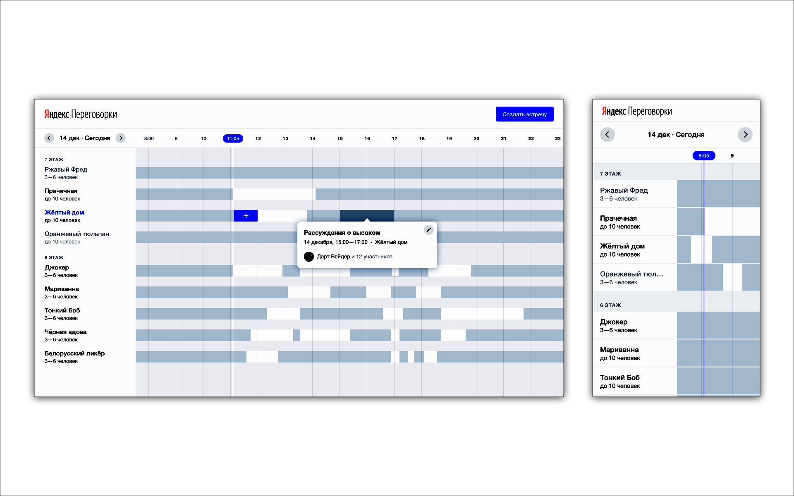
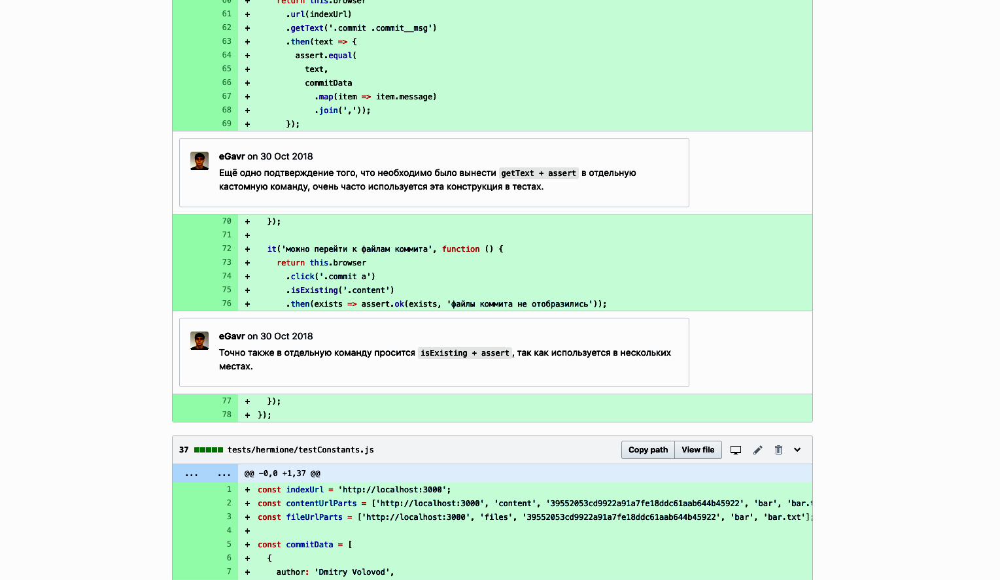
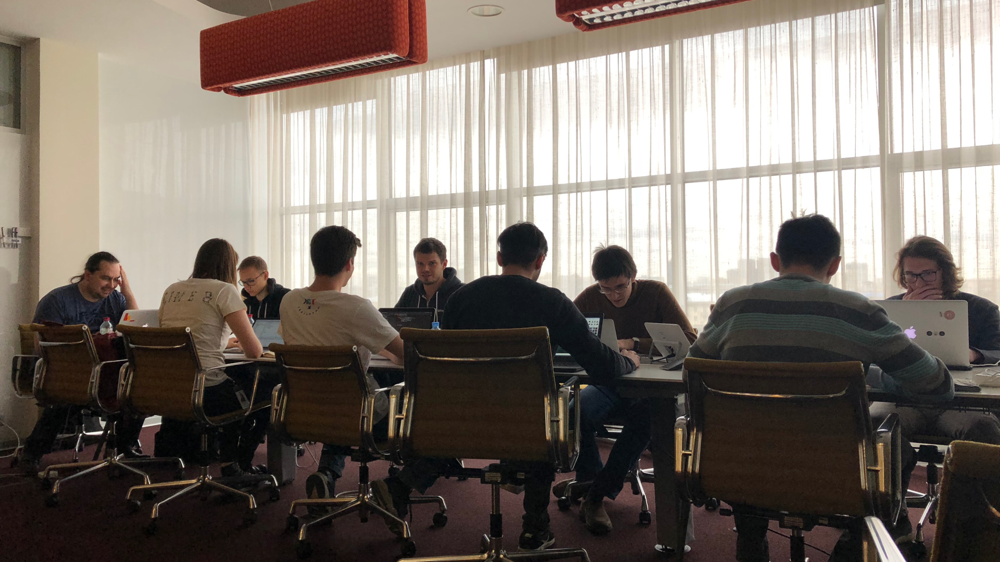
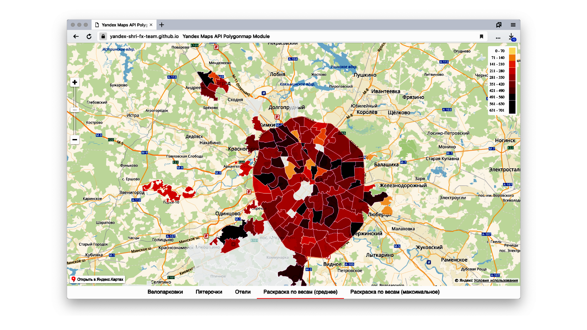

---

layout: yandex2

style: |
    /* собственные стили можно писать здесь!! */
    .rrr { position: absolute; top: 150px; left: 810px;}
    .reviewexample { position: absolute; left: 50%; height: 100%; transform: translateX(-50%);}
    .img-center { margin: 120px auto; display: block; }
    .qrcode { display: block; position: absolute; right: 0; bottom: 0; }
    
---

# {:.logo}

## {{ site.presentation.title }}
{:.title}

### {{ site.presentation.service }}



{:.nda}




{{ site.author.name }}, {{ site.author.position }}





{{ site.author2.name }}, {{ site.author2.position }}



## Что такое ШРИ?
{:.section}

## Что такое ШРИ?

**ШРИ — это курсы фронтенда, которые проводит Яндекс**
 

- {:.next}7 школ, первая в 2012 году
- {:.next}обучение бесплатно
- {:.next}два этапа по 1.5 месяца
  - {:.next}теория: лекции и домашние задания
  - {:.next}практика: работа над проектами в командах
- {:.next}собеседования в Яндекс

## Вступительное задание
{:.section}

## Вступительное задание

**Цель — отобрать кандидатов с нужными заниями и навыками.**
 

- {:.next}запрограммировать алгоритм на JavaScript
- {:.next}сверстать макеты

## Макеты
{:.fullscreen}

## Вступительное задание

**Цель — отобрать кандидатов с нужными заниями и навыками.**
 

- запрограммировать алгоритм на JavaScript
- сверстать макеты
- "найди ошибки"

## Проверка заданий

{:.img-center}

- {:.next}5 — на собеседование
- {:.next}3 — в другой раз
- {:.next}<b>4 — учиться в ШРИ</b>

## Первый этап: теория
{:.section}

## Темы лекций

- адаптивная верстка
- мультимедиа
- работа с Git
- Node.JS
- автотесты
- инфраструктура проектов

- архитектура приложений
- алгоритмы и структуры данных
- клиентская производительность
- типизация: TypeScript
- БЭМ
- дизайн продукта

{:.qrcode}

### [Видеозаписи лекций](https://www.youtube.com/playlist?list=PLKaafC45L_SRqYQW-nFYw8bOlm3IYc2BI)

## Темы лекций

- <b>адаптивная верстка</b>
- мультимедиа
- работа с Git
- Node.JS
- автотесты
- инфраструктура проектов

- <b>архитектура приложений</b>
- алгоритмы и структуры данных
- <b>клиентская производительность</b>
- типизация: TypeScript
- БЭМ
- дизайн продукта

{:.qrcode}

### [Видеозаписи лекций](https://www.youtube.com/playlist?list=PLKaafC45L_SRqYQW-nFYw8bOlm3IYc2BI)

## Темы лекций

- адаптивная верстка
- мультимедиа
- <b>работа с Git</b>
- <b>Node.JS</b>
- автотесты
- инфраструктура проектов

- архитектура приложений
- алгоритмы и структуры данных
- клиентская производительность
- <b>типизация: TypeScript</b>
- БЭМ
- дизайн продукта

{:.qrcode}

### [Видеозаписи лекций](https://www.youtube.com/playlist?list=PLKaafC45L_SRqYQW-nFYw8bOlm3IYc2BI)

## Темы лекций

- адаптивная верстка
- мультимедиа
- работа с Git
- Node.JS
- автотесты
- инфраструктура проектов

- архитектура приложений
- алгоритмы и структуры данных
- клиентская производительность
- типизация: TypeScript
- БЭМ
- <b>дизайн продукта</b>

**тренинг: публичные выступления**
**тренинг: работа в команде**

{:.qrcode}

### [Видеозаписи лекций](https://www.youtube.com/playlist?list=PLKaafC45L_SRqYQW-nFYw8bOlm3IYc2BI)

## Кто читает лекции

- {:.next}разработчики из Яндекса
- {:.next}участвуют в ШРИ добровольно
  - {:.next}чтобы лучше разобратсья в теме
  - {:.next}улучшить навыки выступлений
  - {:.next}нравится учить студентов
- {:.next} повторное чтение лекций

## Информацию трудно воспринимать на слух
{:.blockquote}

## Задачи лекции

1. ~~Раскрыть тему подробно~~
2. {:.next}<b>Сформировать общую картину</b>

## Навигация в торговорм центре
{:.fullscreen}

## Задачи лекции

1. ~~Раскрыть тему подробно~~
2. Сформировать общую картину
3. <b>Объяснить сложные идеи</b>

## Лектор видит реакцию студентов
{:.fullscreen}

## Домашние задания — основная обучающая активность
{:.blockquote}

## Домашние задания

- каждое задание — мини-проект
- результат — pull request

Примеры заданий:

- <b>Node.JS:</b> написать серверное приложение
- {:.next}<b>автотесты:</b> написать модульные и интеграционные тесты
- {:.next}<b>типизация:</b> переписать проект на TypeScript

## Code rview
{:.fullscreen}

{:.reviewexample}

## Темы лекций

- адаптивная верстка
- мультимедиа
- работа с Git
- Node.JS
- автотесты
- инфраструктура проектов

- архитектура приложений
- <b>алгоритмы и структуры данных</b>
- <b>клиентская производительность</b>
- типизация: TypeScript
- БЭМ
- дизайн продукта

{:.qrcode}

### [Видеозаписи лекций](https://www.youtube.com/playlist?list=PLKaafC45L_SRqYQW-nFYw8bOlm3IYc2BI)

## Алгоритмический марафон
{:.fullscreen}

{:.reviewexample}

## Второй этап: практика
{:.section}

## Второй этап: практика

**Студенты работают над проектами в командах**
 

- {:.next}эмуляция реальной работы
- {:.next}нужно комплексно применить знания
- {:.next}важно разделение теории и практики

## Проекты должны быть настоящими

Критерии отбора проектов:

- {:.next}проект приносит пользу и реализуем
- {:.next}проработаны требования
- {:.next}можно реализовать за 1.5 месяца

## Примеры проектов: сервис
{:.fullscreen}

## Примеры проектов: библиотека
{:.fullscreen}

## Примеры проектов: прототип
{:.fullscreen}

### https://habr.com/ru/company/yandex/blog/439884/

## Режим работы 1
{:.fullscreen}

## Режим работы 2
{:.fullscreen}

## Режим работы 3
{:.fullscreen}

## Вручение дипломов
{:.fullscreen}

## Зачем проводить ШРИ?
{:.section}

## Контакты
{:.contacts}



<figure markdown="1">

### {{ site.author.name }}


{{ site.author.position }}


</figure>





<figure markdown="1">

### {{ site.author2.name }}


{{ site.author2.position }}


</figure>



<!-- разделитель контактов -->
-------

<!-- left -->
- {:.mail}dima117a@yandex-team.ru
- {:.telegram}dima117a
- {:.github}dima117

<!-- right -->

## ШРИ — 2019
{:.shout}

{:.qrcode}

### [Оставить заявку](https://yandex.ru/promo/academy/shri)

<!-- 

- {:.mail}author@yandex-team.ru
- {:.phone}+7-999-888-7766
- {:.github}author
- {:.bitbucket}author
- {:.twitter}@author
- {:.telegram}author
- {:.skype}author
- {:.instagram}author
- {:.facebook}author
- {:.vk}@author
- {:.ok}@author

-->
